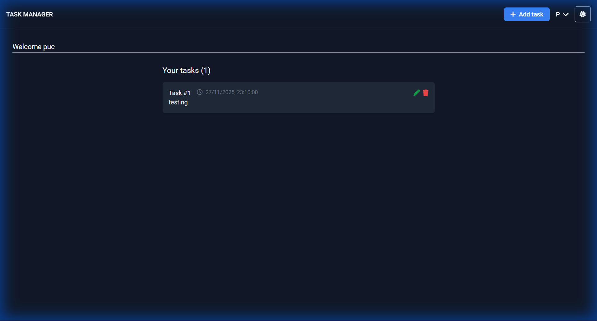

# MERN Task Manager
# MERN Task Manager

A full‑stack task manager built with MongoDB, Express, React, and Node.js. Users can sign up, log in, create and manage tasks, and schedule email reminders using Agenda + Nodemailer.

## Features
- Authentication: signup, login, JWT sessions
- Task CRUD: add, edit, delete, view
- Reminders: schedule email notifications at a date/time
- Agenda job queue with persistence in MongoDB
- Theme toggle: light/dark, responsive UI

### Email Notification System
This application includes a robust email reminder system powered by **Agenda** and **Nodemailer**.
- **Scheduling**: When creating or editing a task, you can set a specific date and time for a reminder.
- **Background Jobs**: The backend uses Agenda to schedule a job that runs at the specified time.
- **Delivery**: At the scheduled time, Nodemailer sends an email to the user's registered email address with the task details.
- **Persistence**: Jobs are stored in MongoDB, ensuring reminders are not lost even if the server restarts.

## Tech Stack
- Backend: Node.js, Express, Mongoose, Agenda, Nodemailer, JWT
- Frontend: React 18, Redux + Thunk, React Router, Tailwind CSS
- Database: MongoDB

## Prerequisites
- Node.js 18+ installed
- MongoDB instance (local or Atlas)
- Git (optional)
- Gmail account with App Password (for SMTP), or any SMTP provider

## Repository Structure
```
backend/
  app.js
  controllers/
  models/
  routes/
  utils/
frontend/
  public/
  src/
  package.json
package.json
```

## Environment Variables (Backend)
Create `backend/.env` and set:
```
PORT=5000
MONGO_URI=mongodb://localhost:27017/mern_task_manager
JWT_SECRET=replace_with_strong_secret

# SMTP (example: Gmail)
SMTP_HOST=smtp.gmail.com
SMTP_PORT=587
SMTP_SECURE=false
SMTP_USER=your_email@gmail.com
SMTP_PASS=your_app_password

# CORS / client
CLIENT_URL=http://localhost:3000
```
Notes:
- For Gmail, create an App Password and use it for `SMTP_PASS`.
- Agenda stores jobs in MongoDB automatically.

## Frontend Proxy
`frontend/package.json` already sets:
```
"proxy": "http://127.0.0.1:5000"
```
This lets the frontend call the backend via `/api` in development.

## Install & Run (Windows cmd)
Open two terminals or run sequentially.

1) Backend
```
cd backend
npm install
npm run dev
```
Expected output: server on `http://localhost:5000`, MongoDB connected, SMTP verified, Agenda started.

2) Frontend
```
cd frontend
npm install
npm start
```
Open `http://localhost:3000` in your browser.

## Quick Start Flow
1. Sign up or log in.
2. Create a task and set a reminder date/time.
3. At the scheduled time, you’ll receive an email notification.

## Useful Scripts
Backend:
- `npm run dev` – start server with nodemon

Frontend:
- `npm start` – start React dev server
- `npm run build` – production build

## API Base
- All endpoints are under `/api`. Examples:
  - `POST /api/auth/signup`
  - `POST /api/auth/login`
  - `GET /api/tasks`
  - `POST /api/tasks` (includes `reminderAt` field)

## Troubleshooting
- Port in use:
  - Backend: another process is using `5000`. Kill Node processes:
    ```
    taskkill /F /IM node.exe /T
    ```
  - Frontend: if `3000` is busy, CRA will offer another port automatically.
- SMTP 535 (BadCredentials):
  - Verify `SMTP_USER` and `SMTP_PASS` (Gmail App Password).
  - Ensure less secure app access isn’t required (use App Passwords).
- Blank screen:
  - Hard refresh (`Ctrl+Shift+R`).
  - Check browser console for errors.
  - Ensure backend is running and `frontend/package.json` proxy is present.
- Browserslist warning:
  - Optional: update database
    ```
    cd frontend
    npx browserslist@latest --update-db
    ```

## Deployment Notes
- Set environment variables on your host.
- Build frontend with `npm run build` and serve statically or via a host.
- Configure SMTP and MongoDB for production.

## License
This project is for educational/demo purposes. Add a license if you plan to distribute.

A MERN application for basic tasks management.


## Table of Contents

- [Features](#features)
- [Tools and Technologies](#tools-and-technologies)
- [Dependencies](#dependencies)
- [Dev-dependencies](#dev-dependencies)
- [Prerequisites](#prerequisites)
- [Installation and setup](#installation-and-setup)
- [Backend API](#backend-api)
- [frontend pages](#frontend-pages)
- [npm scripts](#npm-scripts)
- [Useful Links](#useful-links)
- [Contact](#contact)

## Features

### User-side features

- Signup
- Login
- Logout
- Add tasks
- View tasks
- Update tasks
- Delete tasks

### Developer-side features

- Toasts for success and error messages
- Form validations in frontend and backend
- Fully Responsive Navbar
- Token based Authentication
- Use of 404 page for wrong urls
- Relevant redirects
- Global user state using Redux
- Custom Loaders
- Use of layout component for pages
- Use of theme colors
- No external CSS files needed (made using Tailwind CSS)
- Usage of Tooltips
- Dynamic document titles
- Redirect to previous page after login
- Use of various React hooks
- Custom hook also used (useFetch)
- Routes protection
- Middleware for verifying the user in backend
- Use of different HTTP status codes for sending responses
- Standard pratices followed

## Tools and Technologies

- HTML
- CSS
- Javascript
- Tailwind CSS
- Node.js
- Express.js
- React
- Redux
- Mongodb

## Dependencies

Following are the major dependencies of the project:

- axios
- react
- react-dom
- react-redux
- react-router-dom
- react-toastify
- redux
- redux-thunk
- bcrypt
- cors
- dotenv
- express
- jsonwebtoken
- mongoose

## Dev-dependencies

Following are the major dev-dependencies of the project:

- nodemon
- concurrently

## Prerequisites

- Node.js must be installed on the system.
- You should have a MongoDB database.
- You should have a code editor (preferred: VS Code)

## Installation and Setup

1. Install all the dependencies

   ```sh
   npm run install-all
   ```

2. Create a file named ".env" inside the backend folder. Add data from .env.example file and substitute your credentials there.

3. Start the application

   ```sh
   npm run dev
   ```

4. Go to http://localhost:3000

## Backend API

<pre>
- POST     /api/auth/signup
- POST     /api/auth/login
- GET      /api/tasks
- GET      /api/tasks/:taskId
- POST     /api/tasks
- PUT      /api/tasks/:taskId
- DELETE   /api/tasks/:taskId
- GET      /api/profile
</pre>

## Frontend pages

<pre>
- /                 Home Screen (Public home page for guests and private dashboard (tasks) for logged-in users)
- /signup           Signup page
- /login            Login page
- /tasks/add        Add new task
- /tasks/:taskId    Edit a task
</pre>

## npm scripts

At root:

- `npm run dev`: Starts both backend and frontend
- `npm run dev-server`: Starts only backend
- `npm run dev-client`: Starts only frontend
- `npm run install-all`: Installs all dependencies and dev-dependencies required at root, at frontend and at backend.

Inside frontend folder:

- `npm start`: Starts frontend in development mode
- `npm run build`: Builds the frontend for production to the build folder
- `npm test`: Launches the test runner in the interactive watch mode
- `npm run eject`: This will remove the single build dependency from the frontend.

Inside backend folder:

- `npm run dev`: Starts backend using nodemon.
- `npm start`: Starts backend without nodemon.

## Useful Links

- This project

  - Github Repo: https://github.com/shivasaikrishna000-collab/TaskSphere.git

- Official Docs

  - Reactjs docs: https://reactjs.org/docs/getting-started.html
  - npmjs docs: https://docs.npmjs.com/
  - Mongodb docs: https://docs.mongodb.com/manual/introduction/
  - Github docs: https://docs.github.com/en/get-started/quickstart/hello-world

- Youtube tutorials

  - Expressjs: https://youtu.be/L72fhGm1tfE
  - React: https://youtu.be/EHTWMpD6S_0
  - Redux: https://youtu.be/1oU_YGhT7ck

- Download links

  - Nodejs download: https://nodejs.org/
  - VS Code download: https://code.visualstudio.com/

- Cheatsheets
  - Git cheatsheet: https://education.github.com/git-cheat-sheet-education.pdf
  - VS Code keyboard shortcuts: https://code.visualstudio.com/shortcuts/keyboard-shortcuts-windows.pdf
  - CSS Selectors Cheatsheet: https://frontend30.com/css-selectors-cheatsheet/

## Contact

- Name: Shiva Sai Krishna A
- Email: shivasaikrishna000@gmail.com
